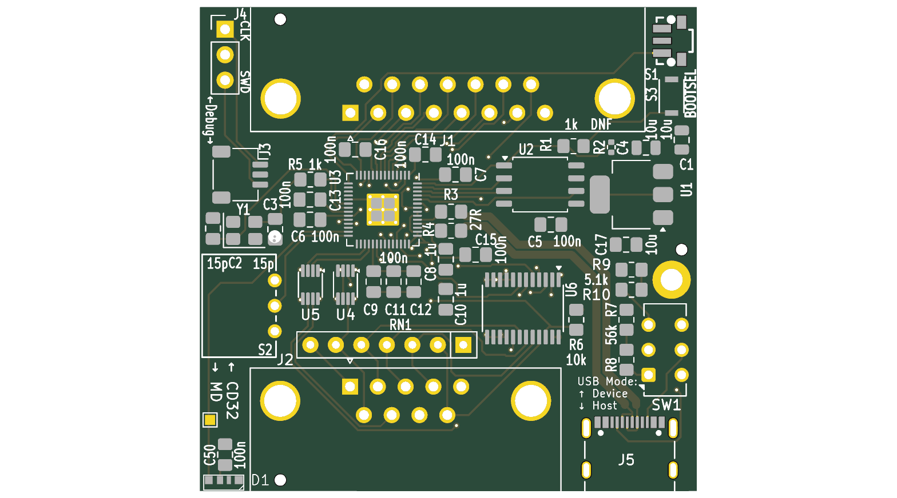
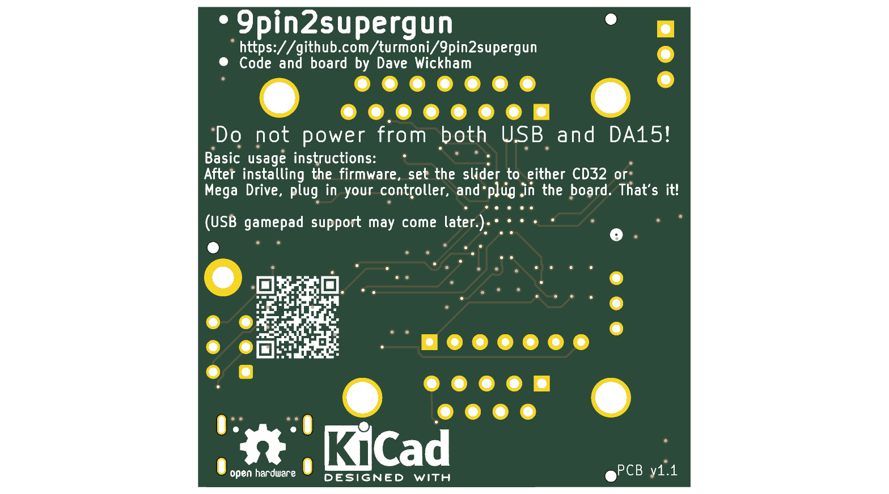

# 9pin2supergun PCB

This is a PCB that contains all the components needed for a fully-functional hardware adapter to work with the [9pin2supergun project](/) in a compact package.

 

## Building one

The KiCad project is in this directory, and for convenience each push gets rendered to [the `rendered` directory](/pcb/rendered/) as a PDF of the schematics, a set of gerber files, and a BOM as a CSV. You *should* be able to use [the gerber archive](/pcb/rendered/gbr.zip) to order boards directly, but for best results you should generate them yourself following your PCB fabricator's instructions (e.g. [for JLCPCB](https://jlcpcb.com/help/article/how-to-generate-gerber-and-drill-files-in-kicad-7)).

Unlike the related [Neo Geo Controller Tester](https://github.com/turmoni/neogeo_controller_tester), this is a moderately advanced soldering job. Don't be scared away from it if you're experienced with soldering (although you may need to learn some new techniques for fine pitched surface-mount components like the RP2040, and you probably want a hot plate, hot air gun, and solder paste), but if you're a complete beginner, this isn't for you.

The [BOM CSV](/pcb/rendered/bom.csv) has the list of parts, but I don't know how useful that is for importing elsewhere. I have [a DigiKey list](https://www.digikey.co.uk/en/mylists/list/U1CG00OTBV) that contains all the components that are needed, although at the time of writing, some of them are not available to order.

You may be able to get this fully/partially assembled from your PCB manufacturer - I didn't do this, so I can't comment, but there are only a few unusual components to manually spec and they are at least in LCSC (JLCPCB)'s database. If I end up doing this, I will probably replace U6 with more of the same type of shifter as U4 and U5 for cost reasons (one less reel to load).

When assembling, note that R2 is marked as DNF - if you're using the specified flash module, you shouldn't need to fit a resistor there. See [Hardware Design with RP2040](https://datasheets.raspberrypi.com/rp2040/hardware-design-with-rp2040.pdf) (PDF) for more information on this, since most of the support circuitry is adapted from that reference design.

## Things to note

SW1 switches between presenting itself as a USB device or a USB host, based on the resistors on the CC pins. This doesn't change anything with the software, and any cables other than Type C to Type C will be entirely unimpacted by this. Set it to Device (up) if you want to plug it into your PC, and Host (down) if you want to plug a gamepad into it. Since there's no code at the moment that uses host mode, it's safe to leave or hardcode it as a device for the moment (connect the middle pins of the switch to their respective top pins, and populate R9 and R10).

Do not power the board from more than one place, e.g. don't plug it into a supergun *and* a USB power source.
