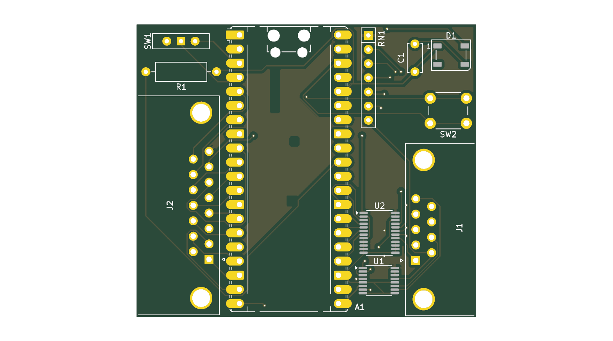

# 9pin2supergun Reference Pico Design

This is a KiCad project for hooking up a Pi Pico to the appropriate hardware to get a fully working setup. As I see it, there are three main purposes for this project:

* To provide the schematic to use if wiring one up by hand, e.g. on a breadboard
* To give me PCBs based on the schematic so I can test that the schematic I've provided actually works, and is what the code expects
* To give a foundation for making new PCBs with different hardware than what I happened to have on hand

# Using the schematic

The schematic is hopefully fairly simple to understand, and can be found either by opening this project up in KiCad, or by looking at [the rendered PDF](rendered/sch.pdf).

# Building a PCB

First up: you probably don't want to use the PCB I've designed. The layout was literally done in about 20 minutes, with very little care given to routing traces to be neat, and it's designed to use the hardware I had on hand. If you want to use the components I've specified, I recommend instead using [the main PCB](../pcb), which is more compact and not *that* much harder to solder than what I have here.

If you do want to modify it, the KiCad project is in this directory.

For convenience each push gets rendered to [the `rendered` directory](rendered/) as a PDF of the schematics, a set of gerber files, and a BOM as a CSV, but again, you probably don't want to use the generated fabrication files as-is.

# Components and their explanations

If you're going to use your own components, the key things are:
 * U2 ([SN74LVC8T245](https://www.ti.com/product/SN74LVC8T245)) - this is just level shifting the input from the controller down to 3.3V. If you want to try out the Pico's 5V tolerance, you can omit this and RN1 if you want. Often the inputs will be either floating or GND, and so safe anyway, but I wouldn't totally rely on this being the case
 * U3/U4 ([SN74LVC2T45DCUR](https://www.ti.com/product/SN74LVC2T45)) - two-bit level shifters. U3 handles those that are always outputs, and U4 handles pin 6, which can either be an input or an output.
 * RN1 (10k resistor network) - pulling up the inputs from the controller port. Omit it if you're also omitting the level shifters
 * SW1 (SPDT switch) - the mode switch. Switches between Mega Drive (floating) and CD32 (tied to GND) modes. You can hardcode this if you're only using one type of controller
 * SW2 (standard push button) - not actually used, but might be helpful in the future
 * D1 (WS2812B LED) - indicates what mode you're in (including if the button rows are flipped in Mega Drive mode). Omit this if you don't care.

## More on level shifting

To recap, the level shifter U2 handles those inputs that are only ever inputs (pulled up to 5V). U3 handles both of the two outputs that can also be the +5V supply. U4 handles the one remaining pin that's either an input or an output depending on whether it's in CD32 or Mega Drive mode. There is nothing particularly special about any of these, they're just directional level shifters that can handle translating 3.3V to 5V or vice versa.
 
The connections to the DE9 connector are as follows:

| Pin | CD32 Function | CD32 Direction | Mega Drive Function | MD Direction |
| --- | ------------- | -------------- | ------------------- | ------------ |
| 1   | Up            | In             | Up/Z                | In           |
| 2   | Down          | In             | Down/Y              | In           |
| 3   | Left          | In             | Left/X/GND          | In           |
| 4   | Right         | In             | Right/Mode/GND      | In           |
| 5   | Latch         | Out            | +5V                 | Out          |
| 6   | Fire 1/Clock  | Out            | B/A                 | In           |
| 7   | +5V           | Out            | Select              | Out          |
| 8   | GND           | N/A            | GND                 | N/A          |
| 9   | Fire 2/Data   | In             | C/Start             | In           |

As the table shows, the DE9 connector is a lot simpler if you're only targetting a single platform; for a CD32, you can permanently wire pin 7 to +5V, and pin 6 as an output, whereas with a Mega Drive controller you can wire pin 5 to +5V and pin 6 as an input. You may also be able to get away with not needing level shifters in this case, if you're willing to risk +5V into your Pico's GPIO pins, and your controller recognises 3.3V logic levels.
